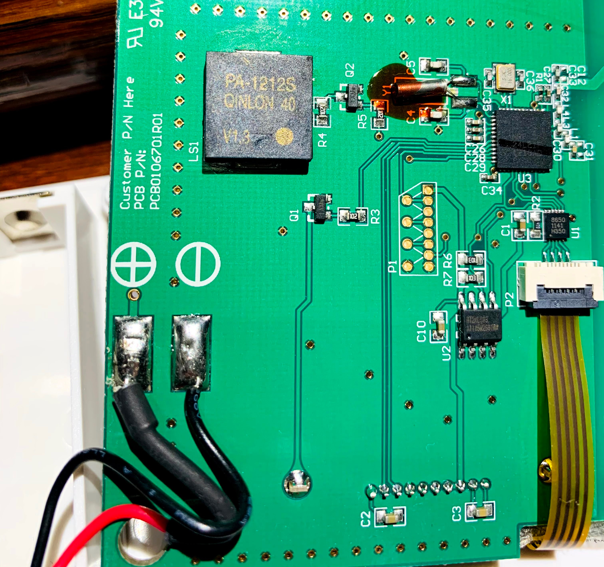
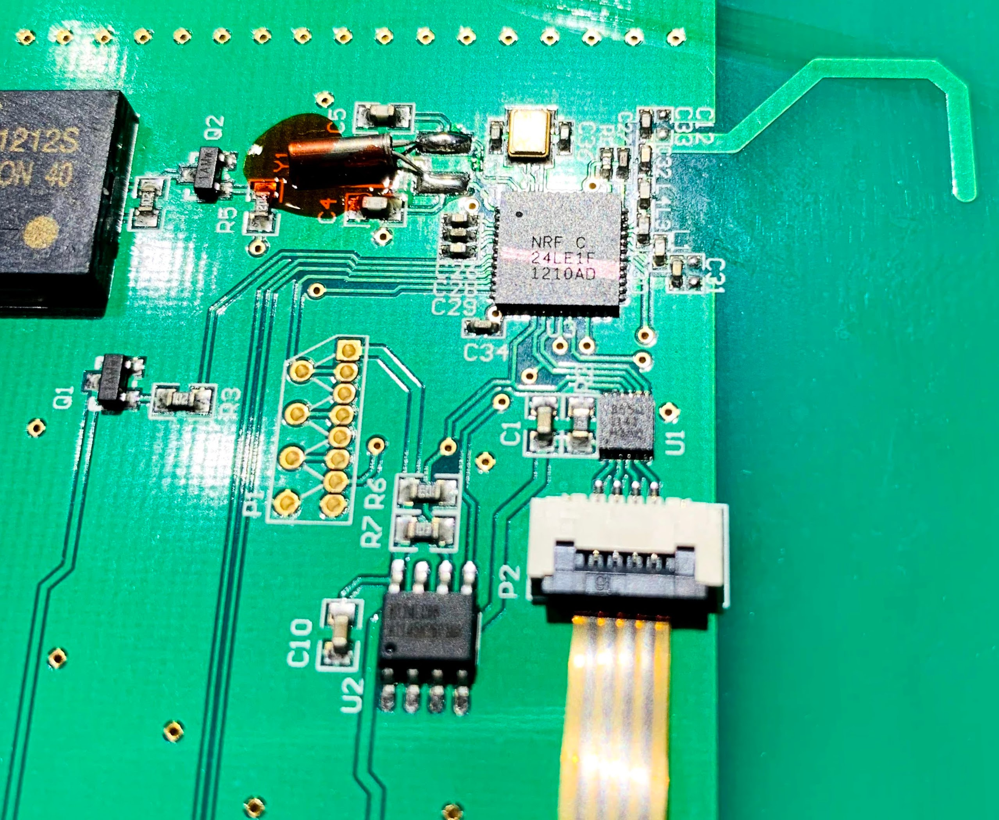
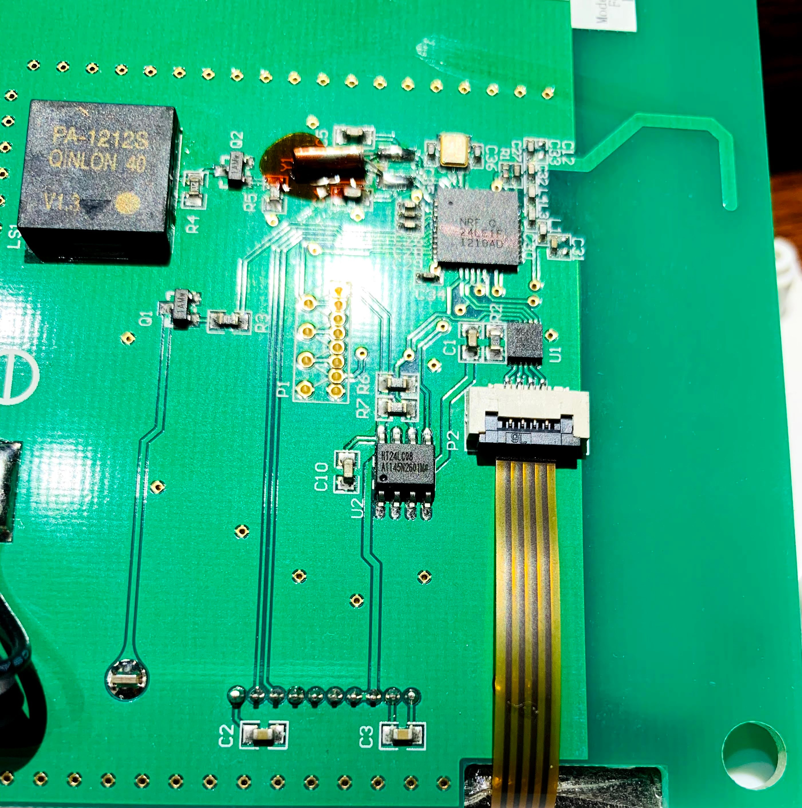
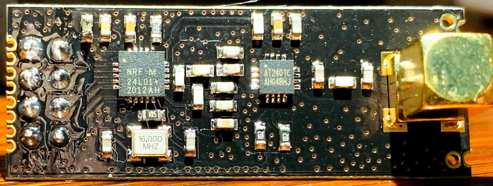

## Dimplex Connex Protocol

This is from my investigations into my personal setup, ymmv

## Dimplex Connex Thermostat Teardown

This is from my broken Dimplex Connex® Multi-Zone Programmable Controller, White - CX-MPC





Nordic makes a family of transceiver's available, including this popular  module available from the usual suppliers. And they are compatible with each other.

## Board Layouts


## ESP32 connection to NRF24L01 Module

```
   gnd - gnd    O O vcc  - 3v3
gpio25 - ce     O O csn  - gpio5
gpio18 - sck    O O mosi - gpio23
gpio19 - miso   O O irq  - gpio4
```

## ESP32 connection to BME280

```
vcc  - 3v3
gnd - gnd
scl - gpio22
sda - gpio21
```

# Tracking down the message protocol

## Background on nRF24L01 protocols

This chipset is pretty popular and alot of work has already been done to make a signal scanner for the 2.4ghz band.  Take a read of this for background 

- https://lastminuteengineers.com/nrf24l01-arduino-wireless-communication/
- https://www.blackhillsinfosec.com/promiscuous-wireless-packet-sniffer-project/

## Step 1 - Create a test environment to find the signal

In order to generate some RF signal traffic I used node-red to change the temperature setting every minute.  ie set it to a value, then a minute later change the setting again, then a minute later start again.  For a temperature setting I had used 17.0 degrees as one of the settings, but later found that this slowed down the effort.  On the wire, the 17.0 degree temperature setting is sent as 170 aka hex AA which is one of the Nordic's protocol's sync values.  It would have gone faster if I had not used 17.0 degrees.  Also 8.5 degrees aka 55 hex has the same issue and should not be used.

## Step 2 - Find the channel used

I started with this firmware package and tweaked it to also include a little bit more data.

https://github.com/insecurityofthings/uC_mousejack

1 - Added logic to the scanner to report on the busiest channel during the reporting period, and dump the raw data packet.

```
0 0 0 0 1 54 0 0 A8 0 0 0 0 0 0 2 A8 0 0 0 0 0 0 0 1 55 54 0 1 54 0 0 3F 28 0 0 0 
A1 55 45 55 55 55 51 55 41 55 50 0 0 5 2 AA A8 2 AA A4 5 5D 50 5 5B AA B5 50 0 0 2 1 3F 28 0 0 0 
AA 95 7A AA 2A AA A8 4 15 55 EA AA 8 15 57 AA AA AA 15 57 AA 80 2A FA AB D5 55 7D 55 AA 95 54 3F 28 0 0 0 
AA 1 0 A0 20 28 2 15 54 4 0 0 0 80 20 50 0 4 0 80 50 8 0 5 2A A8 0 0 81 0 AA AA 3F 28 0 0 0 
A0 0 AA A0 0 40 20 10 0 2 AB 54 A 2 0 A0 40 0 2 AB D5 50 0 AA A9 0 80 20 AA A0 40 40 3F 28 0 0 0 
52 E8 CD 6A AA 66 53 6A A2 B6 95 55 AB 56 BB 55 55 BB 5B 5E CE DD 29 6B A9 C9 6F BF 5F 4D 5B 55 3F 28 0 0 0 
80 0 0 0 0 0 0 0 0 1 54 0 0 0 0 0 0 28 12 0 1 54 0 0 15 50 2A 0 0 5 50 0 3F 28 0 0 0 
0 0 A 2 A8 0 5 40 55 0 1 0 0 0 0 0 A 0 0 0 0 0 0 0 0 0 0 0 0 0 0 0 3F 28 0 0 0 
0 0 0 0 0 0 4 0 0 2 A8 0 0 0 0 10 0 8 20 0 5 20 0 0 3 50 0 0 0 4 0 14 3F 28 0 0 0 
AA AA AA AA AA AA A0 0 A A8 15 54 A A8 A A8 15 54 A A8 0 0 0 0 15 54 0 5 50 0 15 54 3F 28 0 0 0 
A8 0 AA AA AA A0 0 0 55 50 55 55 40 55 55 50 0 55 55 55 50 0 55 55 50 55 50 55 55 50 0 2A 3F 28 0 0 0 
80 0 0 0 0 0 0 55 50 0 0 0 0 0 0 0 0 0 0 0 0 0 0 0 55 40 0 0 0 0 55 40 3F 28 0 0 0 
A0 0 AA A0 0 0 0 0 0 0 AA 80 0 0 0 0 0 0 0 AA AA A0 0 AA 80 0 0 0 55 40 0 0 3F 28 0 0 0 
* busy: 40 speed: 2Mbs count: 36 uptime: 194
```

And found that when the baseboards where changing temperature, their was alot of traffic on channel 40.  But the data was non-sensical with the default 2Mbps data rate (RF_SETUP).

## Step 3 - Find the data rate

I then tweaked the scanner to try different data rates (RF_SETUP) and locked the reciever to channel 40.

At 1Mbps the data looked like this

```
AA AA A8 5 A5 A2 A5 A3 A5 A0 0 5 A0 5A 5 A0 5F FA 0 0 5A 5 FF A0 5 A5 FA 5F A0 5F FA 5 3F 28 0 0 0
A0 0 0 A0 A AA 0 A A A0 AA 0 AA A0 A A0 A0 AA 0 AA A0 AA A0 AA A 0 0 0 0 0 A0 0 3F 28 0 0 0
A0 0 A A A A A 1 29 77 95 D6 F5 AB 4D 5 7A 8A A4 A5 BF FA AA FF FF FF FF FF FF FF FF FF 3F 28 0 0 0
A0 0 0 50 A AA 0 A A A0 AA 0 55 50 5 50 A0 AA 0 55 50 AA A0 55 A 0 0 0 0 0 50 0 3F 28 0 0 0
A0 0 A A A 14 A 1 28 22 54 6E AA EA CC AA A8 4A 95 EF 7F 81 5F FF FF FF EF FF 7F FF FF FF 3F 28 0 0 0
80 0 0 80 A A8 0 8 A 80 A8 0 AA 80 5 40 80 A8 0 AA 80 AA 80 A8 8 0 0 0 0 0 40 0 3F 28 0 0 0
80 0 8 8 8 8 0 3 32 28 B5 1B 2B BA 6C 92 BC 88 11 49 7D EA 2A FF FF FF FF 6F FF FD FD FD 3F 28 0 0 0
A0 0 0 A0 A AA 0 A A A0 AA 0 AA A0 A A0 A0 AA 0 AA A0 AA A0 AA A 0 0 0 0 0 A0 0 3F 28 0 0 0
A0 0 A A A A A 1 A2 B2 93 2D 15 55 11 48 E5 55 92 49 2B F4 2A FF FF FF FF 55 FF FB FB FF 3F 28 0 0 0
A0 0 0 A0 A AA 0 A A A0 AA 0 AA A0 A A0 A0 AA 0 AA A0 AA A0 AA A 0 0 0 0 0 A0 0 3F 28 0 0 0
A0 0 A A A 8A A 1 AB 55 18 4F 2A 97 A9 6F 57 A8 85 4A 8F 75 55 7F FF FF FF FF FF FF FF FF 3F 28 0 0 0
28 22 20 86 5A 9E 22 85 45 4D 8 8D 64 15 0 AA CB C 27 3A 46 51 65 3C 7 30 6C A8 8A D5 45 96 3F 28 0 0 0
A0 1 51 55 A A0 15 55 0 AA A 15 50 15 55 A AA 15 50 A0 0 0 0 0 A 0 0 0 0 0 0 0 3F 28 0 0 0
A8 0 5 5 5 5 5 0 CC F5 AB 56 5A 67 71 36 62 A2 8A EA A5 FA 8A BF FF FF FF FF FF FF FF FF 3F 28 0 0 0
A0 0 0 A0 A AA 0 A A A0 AA 0 AA A0 A A0 A0 AA 0 AA A0 AA A0 AA A 0 0 0 0 0 A0 0 3F 28 0 0 0
A0 0 A A A A A 1 A5 6A AD A0 68 B4 6A E1 56 95 29 A CE F5 15 7F FF FF FF FF FF FF FF FF 3F 28 0 0 0
D3 56 9B 75 6A 9E 16 2 C1 3A ED 2B 53 B2 A2 A5 45 47 E5 20 E5 1D 34 D5 57 62 55 A5 22 71 64 A2 3F 28 0 0 0
* busy: 40 speed: 1Mbs count: 27 uptime: 258
```

And at 250kbps the data looked like this

```
A0 92 70 4E 2D 9E D6 77 CD 01 00 00 7D 09 01 00 CF 62 1D 69 5A B0 AA 55 50 49 38 27 16 CF 64 8A 3F 28 00 00 00 
A0 92 70 4E 2D 9E D6 77 CD 01 00 00 7D 09 01 00 CF 62 3B 6D 77 F4 54 55 50 44 B8 37 96 CD 34 69 3F 28 00 00 00 
A0 92 70 4E 2D 9E D6 77 CD 01 00 00 7D 09 01 00 CF 62 3D 6F C9 3C AA 6A D4 24 9C 13 97 ED 4A 78 3F 28 00 00 00 
A0 92 70 4E 2D 98 D6 77 CD 01 00 00 7D 09 01 00 3E 96 2D 56 EB 7A DB 52 A8 24 9C 13 8B 6F 7A 45 3F 28 00 00 00 
A0 92 70 4E 2D 9C D6 77 CD 01 00 00 7D 09 01 00 6F D1 34 F7 EE B8 55 2A A8 24 9C 13 8B 67 3A 55 3F 28 00 00 00 
A0 92 70 4E 2D 9C D6 77 CD 01 00 00 7D 09 01 00 6F D1 27 5E 9B 58 AA 2A A8 24 9C 13 8B 66 2A 74 3F 28 00 00 00 
A0 92 70 4E 2D 9C D6 77 CF 01 00 00 7D 09 01 00 E0 77 FC D4 AD 68 55 2A A8 24 9C 13 8B 66 2A 74 3F 28 00 00 00 
A0 92 70 4E 2D 9C D6 77 CD 01 00 00 7D 09 01 00 6F D1 3A BE 75 D8 55 2A A8 24 9C 13 8B 66 2A 74 3F 28 00 00 00 
8C 77 5B F5 61 54 AA A0 92 70 4E 2D 9E C9 15 1F 7D EB 6F BF 56 AF 7D 5E FB DD D4 3A 64 C8 13 AC 3F 28 00 00 00 
A0 92 70 4E 2D 98 D6 77 D0 01 00 00 7D 09 01 00 55 46 37 2B DA 9C 00 00 54 12 4E 09 C5 B3 15 3A 3F 28 00 00 00 
82 49 C1 38 B6 63 59 DF 40 04 00 01 F4 24 04 01 55 18 B5 DB DF 61 54 AA A0 92 70 4E 2D 9E C9 15 3F 28 00 00 00 
A0 92 70 4E 2D 98 D6 77 D0 01 00 00 7D 09 01 00 55 46 35 BA FD F8 54 2A A8 24 9C 13 8B 66 A2 64 3F 28 00 00 00 
A0 92 70 4E 2D 98 D6 77 D0 01 00 00 7D 09 01 00 55 46 2D DD 7D FC 55 2A A8 24 9C 13 8B 66 A2 64 3F 28 00 00 00 
A0 92 70 4E 2D 9C E9 57 1E D5 57 A6 AD E9 49 EE EB 5C DE B5 AA FA A1 57 7B AD 35 5D A5 6B 4B 57 3F 28 00 00 00 
A0 92 70 4E 2D 98 D6 77 D1 01 00 00 7D 09 01 00 12 95 3B FD A9 BD AA 2A 50 24 DC 17 96 C6 B5 64 3F 28 00 00 00 
A0 92 70 4E 2D 98 D6 77 D1 01 00 00 7D 09 01 00 12 95 3F 73 6A B8 00 28 10 64 9C 37 8B 66 A2 64 3F 28 00 00 00 
A0 92 70 4E 2D 98 D6 77 D1 01 00 00 7D 09 01 00 12 95 3F B9 E5 F8 AA 55 50 49 38 27 16 CE 74 AB 3F 28 00 00 00 
* busy: 40 speed: 250kbps count: 35 uptime: 4758
```

Paydirt 250kbps

## Step 3 - Taking the signal apart

These are my initial thoughts

```
A0 92 70 4E 2D 98 D6 77 D1 01 00 00 7D 09 01 00 12 95 3F B9 E5 F8 AA 55 50 49 38 27 16 CE 74 AB 3F 28 00 00 00 
```

 * Connex message structure
 * address              - aka A0 92 70 4E 2D
 * Shockburst pipe      - aka 98/9A/9C/9E
 * zonea                - 2 bytes Appears to change for each zone aka D6 77
 * sequence             - message sequence number aka D1
 * unknown1             - unknown byte field, typically aka 01
 * zone                 - zone for the message aka 00
 * targetTemperature_C  - temperature setting in celcius, / 10 to obtain
 * length               - Guessing 9 bytes
 * ???                  - aka 01 00
 * crc                  - Guessing 2 byte crc value

 ## Step 4 - Is is an Enhanced ShockBurst message ?

 Looking at this portion of the message

 ```
 2D 98 D6
 2D 9E D6
 2D 9C D6
 2D 9A D6
 ```

Is the 98/98/9C a PID in the ESB Packet Control Field? Maybe, spec says this.

```
Packet Control Field

Payload length 6bit
PID 2bit
NO_ACK 1bit
```

```
              2    D    9    8    D    6
2D 98 D6 --> 10 1101 1001 1000 1101 0110
2D 9A D6 --> 10 1101 1001 1010 1101 0110
2D 9C D6 --> 10 1101 1001 1100 1101 0110
2D 9E D6 --> 10 1101 1001 1110 1101 0110
                                                                        
                      A    0    9    2    7    0    4    E    2    D    9    8    D    6
A092704E2D98D6 --> 1010 0000 1001 0010 0111 0000 0100 1110 0010 1101 1001 1000 1101 0110

If this is an ESB Message, and that is the PID, then the address field is 6 bits to the left
                                                                        | length   | PID|Sync|
A092704E2D98D6 --> 1010 000|0 1001 001|0 0111 000|0 0100 111|0 0010 110 | 1 1001 1 | 00 | 0 |1101 0110

address 50 49 38 27 16
```

length - This field is only used if the Dynamic Payload Length function is enabled. So am thinking this can be ignored.

sync/ack - Setting the flag high tells the receiver that the packet is not to be auto acknowledged.

Am thinking that this is a enhanced shockburst with a fixed message size of 10 bytes

 ## Step 5 - Putting it together does it all work together?

Tried a hard coding a payload length of 10 bytes into the scanner code to look at the crc calc.

```
p: 1 50 49 38 27 16 CF 6B 3B B4 00 80 00 41 04 80 80 25 4B 1D FA DA D8 55 2A A8 24 9C 13 8B 67 3A 55 3F 28 00 00 00 
found packet /w valid crc... payload length is 10
ch: 40 s: 10 a: 50 49 38 27 16  p: D6 77 68 1 0 0 82 9 1 0 

starting scan...
2 busy: 40 speed: 250Kbs count: 2 uptime: 92
p: 1 50 49 38 27 16 CF 6B 3B B4 00 80 00 41 04 80 80 25 4B 1A FB D5 DE 2A 95 54 12 4E 09 C5 B3 15 3A 3F 28 00 00 00 
found packet /w valid crc... payload length is 10
ch: 40 s: 10 a: 50 49 38 27 16  p: D6 77 68 1 0 0 82 9 1 0 

starting scan...
1 busy: 40 speed: 250Kbs count: 1 uptime: 92
p: 1 12 A9 75 A9 5B AB B9 5D 37 CD 2B 59 E9 9C DF 45 55 CD E6 B5 FD B6 C9 6D 8F AB 6B 31 AB AB 55 6D 3F 28 00 00 00 
p: 1 50 49 38 27 16 CD 6B 3B B4 00 80 00 41 04 80 80 0D E8 95 4D 1A 5E 00 0A AA 09 27 04 E2 D9 8A 9D 3F 28 00 00 00 
found packet /w valid crc... payload length is 10
ch: 40 s: 10 a: 50 49 38 27 16  p: D6 77 68 1 0 0 82 9 1 0 

starting scan...
2 busy: 40 speed: 250Kbs count: 2 uptime: 92
p: 1 50 49 38 27 16 CD 6B 3B B4 00 80 00 41 04 80 80 0D E8 86 DB AB E8 55 2A A8 24 9C 13 8B 67 92 66 3F 28 00 00 00 
found packet /w valid crc... payload length is 10
ch: 40 s: 10 a: 50 49 38 27 16  p: D6 77 68 1 0 0 82 9 1 0 
```

Looks like it works

## Temperature setting change

Address set to 0x0092704e2d and length to 4 bytes

```
Powered off base board heaters

282840: 9E D6 77 7C 1 0 0 AA 9 1 0 CA C2 BD 56 BF AE 1B 95 7F EB 6F DA ED 1E 35 1F 2D 5D AD 75 7F 0 0 0 0 0
283840: 98 D6 77 7D 1 0 0 AA 9 1 0 7C E5 DC D5 EE AB 53 5B AA D5 D9 EB DE F7 EA 52 A5 4D 96 51 54 0 0 0 0 0
284840: 9A D6 77 7E 1 0 0 AA 9 1 0 14 23 FF F7 7F 5E B7 FB 39 56 6D 9E DD DA DE 6B BA 99 FB 7D 5D 0 0 0 0 0
285840: 9C D6 77 7F 1 0 0 AA 9 1 0 A2 4 EA 83 4A D0 24 AC 2A 86 19 65 32 A4 56 C5 6C AA C4 B5 16 0 0 0 0 0
286840: 9E D6 77 80 1 0 0 AA 9 1 0 96 F8 FE 9F 78 DC 5A DD DA 7A D7 D9 B9 BF 6D BF FE FB DD 7F FF 0 0 0 0 0
287840: 98 D6 77 81 1 0 0 AA 9 1 0 20 DF D5 AB 5E E5 5C 6D 6E D7 95 AF D5 90 91 79 6A 8A D5 5B 57 0 0 0 0 0
288841: 9A D6 77 82 1 0 0 AA 9 1 0 48 19 DA 9B 6E D6 D5 FB 7B 75 6F BB 3F 55 EF 76 DF B7 AA AE EA 0 0 0 0 0
289841: 9C D6 77 83 1 0 0 AA 9 1 0 FE 3E DA AD 5A D7 6D 55 5B 9A 85 28 2A 59 29 53 37 94 50 D4 B7 0 0 0 0 0
290841: 9E D6 77 84 1 0 0 AA 9 1 0 99 95 D7 EF 2B 56 AA AB 7A FA BA B6 B7 EF 5E AA DB 72 9B DE FD 0 0 0 0 0
291841: 98 D6 77 85 1 0 0 AA 9 1 0 2F B2 FF 5B B7 6D B4 EF 76 D7 B6 BD 6F DD CD AE FE DD BE FE FA 0 0 0 0 0
```
Thermostat appears to resend setting change 10 times over 10ms


```
Powered back on again

345453: 9A D6 77 86 1 0 0 B4 9 1 0 FE 89 C7 55 73 B8 55 2A A8 24 9C 13 8B 66 2A F4 CD 73 F7 FE BB 0 0 0 0 0
345544: 9A D6 77 86 1 0 0 B4 9 1 0 FE 89 25 3B 76 D8 1 2A A8 24 9C 13 8B 66 A2 64 4D BD EA DD 6E 0 0 0 0 0
345549: 9A D6 77 86 1 0 0 B4 9 1 0 FE 89 3D FF 7D F8 AA 55 50 49 38 27 16 CE 74 AB 8D 6A BA AB BD 0 0 0 0 0
345554: 9A D6 77 86 1 0 0 B4 9 1 0 FE 89 3E B9 77 78 AA 55 50 49 38 27 16 CF 64 8A 93 BF B6 F5 2B 0 0 0 0 0
345558: 9A D6 77 86 1 0 0 B4 9 1 0 FE 89 2F B9 6A B8 55 2A A8 24 9C 13 8B 66 2A 74 CA AF AF FF AF 0 0 0 0 0
345563: 9A D6 77 86 1 0 0 B4 9 1 0 FE 89 34 D7 B5 D8 55 2A A8 24 9C 13 8B 66 A2 64 4D B7 DF EB EA 0 0 0 0 0
345568: 9A D6 77 86 1 0 0 B4 9 1 0 FE 89 3A EF B6 B8 55 2A A8 24 9C 13 8B 67 3A 55 CB D5 FC F7 AE 0 0 0 0 0
345573: 9A D6 77 86 1 0 0 B4 9 1 0 FE 89 3D 39 7E B8 AA 55 50 49 38 27 16 CF 64 8A 8E EA D5 42 90 0 0 0 0 0
345577: 9A D6 77 86 1 0 0 B4 9 1 0 FE 89 2B BD F7 BC 55 2A A8 24 9C 13 8B 66 2A 74 CE EF DB 9F FD 0 0 0 0 0
345582: 9A D6 77 86 1 0 0 B4 9 1 0 FE 89 3F AE 6E 98 55 2A A8 24 9C 13 8B 66 A2 64 4E FF DD 77 54 0 0 0 0 0
345587: 9A D6 77 86 1 0 0 B4 9 1 0 FE 89 2F FB DE B8 AA 55 50 49 38 27 16 CE 74 AB 89 CD 75 FD 6A 0 0 0 0 0
345592: 9A D6 77 86 1 0 0 B4 9 1 0 FE 89 2B 7D EA B8 AA 55 50 49 38 27 16 CF 64 8A 8C B3 F7 BF 9F 0 0 0 0 0
345596: 9A D6 77 86 1 0 0 B4 9 1 0 FE 89 2B 5B 5B 38 AA 55 50 49 38 27 16 CC 54 E9 87 FD 7F ED EF 0 0 0 0 0
345601: 9A D6 77 86 1 0 0 B4 9 1 0 FE 89 3F 6E 95 B8 AA 55 50 49 38 27 16 CD 44 C8 9A FD 75 F7 B6 0 0 0 0 0

346453: 9C D6 77 87 1 0 0 B4 9 1 0 48 AE DF FD 7D 98 AA 2A A8 25 BC 13 8F 47 3A 55 C9 D7 5F FF AD 0 0 0 0 0
346574: 9E D6 77 87 1 0 0 B4 9 1 0 E8 1D 35 FD 7A BC 0 15 54 12 4E 9 C5 B3 D9 22 A7 B7 6D 3F 76 0 0 0 0 0
346578: 9E D6 77 87 1 0 0 B4 9 1 0 E8 1D 3F 6F EE F8 55 2A A8 24 9C 13 8B 66 2A 74 CF 77 35 AF 66 0 0 0 0 0
```
Looking at these packets in detail, their appears to also be two packets per row `AA 55 50 49 38 27 16 CF 64 8A`

## Thermostat to Baseboard pairing

Inital data collection offered no clues

## Compiler Directives

```
	'-DCE_GPIO=25'
	'-DSCK_GPIO=18'
	'-DMISO_GPIO=19'
	'-DCSN_GPIO=5'
	'-DMOSI_GPIO=23'
	'-DIRQ_GPIO=4'
```